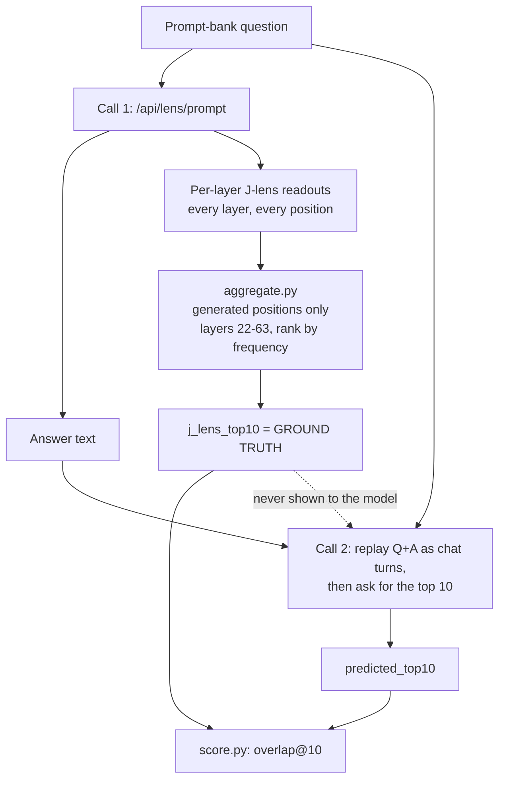

# J-lens Verbalization

**Can a model accurately report the concepts active in its own internal
computation -- or does it just produce a plausible-sounding list inferred
from the text it can already see?**

This repo measures that. It pairs ground-truth **Jacobian Lens** readouts,
taken from Qwen3.6-27B *while it answers a question*, against the model's own
verbal guess at what those readouts were, under three conditions designed to
separate genuine introspective access from fluent guessing.

- **Browse the data:** <https://rao-aditya-127.github.io/J-lens-verbalization/>
- **Dataset:** <https://huggingface.co/datasets/RaoAditya/j-lens-verbalization>

## The result

Phase 1 (the prompted baseline) is complete. 223 prompts x 3 conditions =
669 introspection calls, 100% clean parsing.

| condition | overlap@10 | precision | recall | f1 |
|---|---|---|---|---|
| `few_shot_icl` | **0.274** | 0.277 | 0.274 | 0.275 |
| `zero_shot` | 0.211 | 0.212 | 0.211 | 0.211 |
| `text_only_control` | 0.191 | 0.192 | 0.191 | 0.191 |

Aggregates in this project have repeatedly hidden large per-domain variation,
so the per-source view is the one that matters:

| source | zero_shot | few_shot_icl | text_only_control |
|---|---|---|---|
| gsm8k | 0.264 | **0.366** | 0.158 |
| bbh | 0.200 | **0.236** | 0.204 |
| truthfulqa | 0.194 | **0.237** | 0.192 |
| arc | 0.275 | **0.312** | 0.283 |
| hotpotqa | 0.156 | **0.237** | 0.164 |

**What this establishes:**

1. There is a real, above-chance grounding signal. Zero-shot's 0.211 is far
   from chance against a ~248k-token vocabulary -- but it recovers only a
   minority of the true concept set. This is a baseline to beat, not evidence
   of strong introspection.
2. Few-shot ICL beats zero-shot in **every single source**, not just in
   aggregate. A broad-based effect, not one domain carrying the average.
3. **Zero-shot barely beats the text-only control outside GSM8K** -- it is
   *behind* the control in BBH, ARC and HotpotQA. Merely asking a model to
   introspect does not reliably outperform guessing from the text. Few-shot
   ICL, however, beats the control everywhere. The defensible reading:
   grounded self-report is *elicitable via demonstration*, not spontaneously
   produced just by asking.
4. None of these comparisons have confidence intervals yet. See
   [Next steps](#next-steps).

## How it works

Each row costs two API calls. The first produces both the answer and the
ground truth; the second asks the model to guess that ground truth back.



The ground truth is **never** in the model's context on call 2. It is derived
from call 1's readouts and used only for scoring.

### The three conditions

All three see the same question and the same answer. They differ only in the
framing of the second call:

| condition | what the model gets | what it isolates |
|---|---|---|
| `zero_shot` | Q + A, then asked to introspect | unaided self-report |
| `few_shot_icl` | same, preceded by 2 worked demonstrations built from real J-lens data | whether demonstrations teach the format *and* the grounding |
| `text_only_control` | Q + A, asked to **guess** from the text -- no introspective framing | how much agreement is reachable with no introspective claim at all |

The control is the load-bearing one. Without it, a decent overlap score is
uninterpretable: a model that has just written an answer about percentages
will say "percentage" whether or not it has any internal access.

## Repo layout

```
dataset/
  prompt_bank/
    build_prompt_bank.py     # one script, per-source --*-count flags
    README.md                # source rationale, regeneration
  jlens/
    config.py                # locked experimental configuration
    aggregate.py             # pure (response, config) -> top-10 function
    client.py                # paced, retrying, timeout-guarded API wrapper
    prompts.py               # all 3 condition prompts + response parsing
    collect.py               # two-phase resumable collection CLI
    score.py                 # overlap@10 / precision / recall / F1
    viewer/index.html        # self-contained browser for the collected data
    README.md                # pipeline detail
think/                       # research notes -- git-ignored, kept locally
  decision_log.md            # authoritative history: every decision, bug, and result
index.html                   # root redirect to the viewer, for GitHub Pages
```

`think/` and all `*.jsonl` are git-ignored -- the data lives on Hugging Face
(see above), which is why the viewer fetches rather than reads from the repo.

## Reproducing

```bash
pip install python-dotenv datasets
cp .env.example .env          # then add your NEURONPEDIA_API_KEY

python dataset/prompt_bank/build_prompt_bank.py
python dataset/jlens/collect.py answers          [--limit N] [--per-source-limit N]
python dataset/jlens/collect.py introspection    [--limit N] [--condition zero_shot|few_shot_icl|text_only_control|all]
python dataset/jlens/score.py
```

Both collection phases are **resumable** -- already-collected rows are
skipped, so an interrupted run is restarted by re-issuing the same command.
Start with `--limit 20` and eyeball the output before the full run. Prefer
`--per-source-limit` for pilots: `--limit` takes a file-order prefix, which
means a small pilot draws entirely from GSM8K and tells you almost nothing.

Every raw API response is saved gzipped under `dataset/jlens/raw/`, so the
layer window, the top-k, or the parsing rule can all be revisited later by
re-running `aggregate.py` with **no new API calls**. This is why `aggregate.py`
is a pure function of `(response, config)`.

Expect several hours for the full 225-row run: Neuronpedia allows 240
requests/hour and the client paces itself at one call per 16s.

## Method

| parameter | value |
|---|---|
| model | `qwen3.6-27b` (via Neuronpedia) |
| lens | `JACOBIAN_LENS`, `POST /api/lens/prompt` |
| layer window | 22-63 (of 64) |
| readouts per layer | `topN=8` -- the API's ceiling, not a choice |
| aggregation | frequency across kept layer slices, generated positions only, top 10 |
| temperature | 0 |
| ICL demos | 2, fixed: `truthfulqa_0010`, `hotpotqa_0013` |
| metric | overlap@10 on exact normalized-string set intersection |
| sources | GSM8K, BIG-Bench Hard, TruthfulQA, ARC-Challenge, HotpotQA (bridge) |

Five sources is deliberate. GSM8K has been the outlier in *every* comparison
this project has run -- a single-source result here would have been
misleading three separate times.

### Things worth knowing about the API

Reverse-engineered from source; the rendered docs don't cover these.

- `topN` caps at **8**, so a "top 10" target cannot come from one layer.
- There is **no** `layers` request parameter. All layer filtering is
  client-side, which is what makes cheap re-analysis possible.
- Per-message caps are 1024 chars for user turns, 10000 for assistant/system.
- There is a separate, **undocumented ~2048-token whole-conversation limit**.
  This is what capped the ICL set at 2 demonstrations rather than 3 -- it is
  not a design preference, it is a hard budget.

## Known limitations

- **Exact-match scoring.** `"Percentage Multiplication"` vs. J-lens's
  `"percentage"` scores as a total miss. Stemmed, mass-weighted and rank-1
  variants were all tried post-hoc; they move the numbers modestly without
  changing the ordering, so the simpler metric was kept.
- **Top-10-by-frequency may be the wrong target.** The top ranks skew toward
  concepts obviously implied by the prompt. Whether the mid-frequency band
  carries more interesting signal is open.
- **No significance testing yet.** The largest gap in the current result.
- ICL demonstrations went through a full redesign after the original pair was
  found to share a bias that inflated one token across the whole dataset. The
  fix changed the substantive finding -- ICL scored 0.213 before and 0.274
  after.

## Next steps

1. **Bootstrap confidence intervals** over the already-collected rows. Zero
   new API calls, and it decides whether the zero-shot-vs-control claim
   survives.
2. **Causal intervention.** List agreement is correlational. The API supports
   `steerTokens` / `steerAblate` / `swapToken` -- do concepts the model
   *correctly* reported matter more causally than ones it missed?
3. **Post-training an introspection model.** The original goal, gated behind
   a reliable ICL improvement, which Phase 1 now establishes.

## Data and licensing

Questions derive from GSM8K, BIG-Bench Hard, TruthfulQA, ARC-Challenge and
HotpotQA, each under its own upstream license. Answers and lens readouts are
generated. No project license is set yet.
