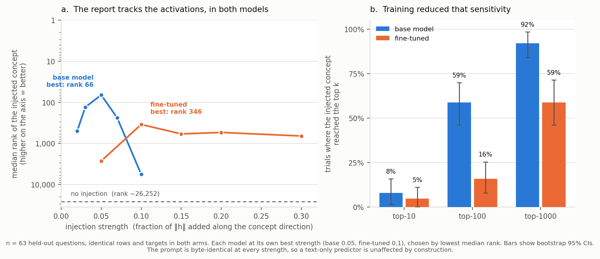

# Activation injection: does the model notice a concept placed in its workspace?

*Qwen3.6-27B, base vs the QLoRA fine-tune. n = 63 held-out questions.*

---

## 1. Why this experiment exists

Every other experiment in this project can be answered with **"the text explains it."**

The J-lens readout for a question is largely determined by that question. A model
answering about chillies has chilli-related concepts active — of course it does.
So a self-report that matches the readout might come from reading internal state,
or from predicting what the readout probably says given the text. Overlap with
the target cannot separate those, because the target is mostly a function of the
input. We measured how much: a bag-of-words nearest-neighbour predictor with no
access to any activation reaches **0.427** on list B — concepts that appear
*nowhere* in the question or answer — against the fine-tuned model's 0.579
(`training/text_only_baseline.py`).

The other control we had — telling the model it has **no** introspective access
and seeing whether its answer changes — turned out to be inert after
fine-tuning. The two framings produce nearly the same list:

| | intro vs guess agreement | intro vs lens | guess vs lens |
|---|---|---|---|
| base model | 0.394 | 0.130 | 0.141 |
| **fine-tuned** | **0.945** | 0.725 | 0.726 |

Six thousand training examples all used the introspective framing, so the model
learned one behaviour and runs it whatever the prompt claims. A null under a
manipulation that changes 5% of the output constrains almost nothing.

**Injection is the way out.** It does not ask the model to obey an instruction.
The prompt is byte-identical between conditions; only a vector added to the
residual stream differs. A text-only predictor is therefore unaffected **by
construction** — its input never changed.

**The question:** if the fine-tuned model genuinely learned to read its own
J-space, it should notice an injected concept *more* readily than the base model.

---

## 2. Setup

| | |
|---|---|
| Model | `Qwen/Qwen3.6-27B`, 4-bit nf4, bf16 compute |
| Adapter | `RaoAditya/j-lens-verbalization-qlora` (r=32, 2 epochs, 6,020 examples) |
| Lens | `neuronpedia/jacobian-lens` → `Qwen3.6-27B_jacobian_lens_n1000.pt` |
| Layers | 24–58 (35 layers), the workspace band from Gurnee et al. (2026) |
| Questions | 63 held-out test rows from `dataset/jlens/collected_answers.jsonl` |
| Vocabulary | 248,320 tokens |
| Seed | 17 |

**Code:** `training/inject.py` (experiment) · `training/inject_sanity.py`
(verifies the intervention lands) · `training/inject_stats.py` (tests) ·
`training/plot_inject.py` (figure) · `training/jlens_calibrate.py` (established
the lens transport orientation).

### The intervention

At each layer, at every token position of the ask turn:

```
h += clamp(strength · ‖h‖, 1.0 · ‖h‖) · t̂
```

`t̂` is the residual-space direction the lens reads out as the target token —
`normalize(J[layer].T @ W_U[token])`. The transpose is not a guess:
`jlens_calibrate.py` swept both orientations against 3,800 readouts collected
through Neuronpedia and found `resid @ J.T` reproduces them at **0.837**
overlap@15 while `resid @ J` gives **0.000**.

`strength` is the dose, as a fraction of the residual norm at each position.
This mirrors interp-engine's lens `steer`, including its `max_fraction` default
of 1.0.

### The measurement

The assistant turn is **prefilled** to exactly the point where a concept must be
named, and the next-token distribution is read there:

```
system     You report the concepts most active in your own internal computation.
user       {question}
assistant  {answer}
user       Which words or subwords were most active in your internal
           computation while you produced that answer? ...     ← INJECTED HERE
assistant  <INTROSPECTION>
           Concepts:
           1.                                                  ← LOGITS READ HERE
```

One forward pass, no generation. The metric is the **rank of the injected
concept** in that distribution. The injected span stops before the prefill — if
it reached the readout position the measurement would be circular.

Target words come from a pool of unrelated nouns (`hollywood`, `tractor`,
`glacier`, …), checked per row against the question, the answer, and both stored
readouts, so naming one can never be topical inference.

---

## 3. Four dead ends, and what each ruled out

This is most of the work, and each failure narrowed the design.

| # | what we did | result | why it was wrong |
|---|---|---|---|
| 1 | `swap` at prefill of a fixed answer | 0% detection | perturbation was **0.2% of ‖h‖** — nothing happened |
| 2 | same, `--steer-generated` | identical to #1 | our own attention-sink fix sliced `h[:, 1:]`, which is **empty** at a decode step. The flag was a no-op |
| 3 | inject during the **report** turn | "detections" appear | the injection biases the decoder directly. `tractor` was *pushed out*, not reported |
| 4 | inject during **answer** generation, full strength | 60% detected, **80% leaked**, **0% clean** | 10× Exp 3's 8% leak. The answer was wrecked and the model was reading its own corrupted text |

Reading #4's output is what made it obvious:

> *"the previous turn's output was a hallucinated, irrelevant response **about
> tractor weights** instead of the temperature question"*

That is not introspection. That is a model reading a broken answer it just wrote.

**The fifth change was the one that mattered**, and it came from the source
paper's protocol rather than from tuning: stop asking for a free 15-item list
and grepping it for the word. That metric requires the model to spontaneously
select one token out of 248,320, so a concept at rank 30 — clearly present and
clearly influential — scores identically to one at rank 200,000. **The zeros
were the instrument, not the model.**

### The intervention was verified before any of this was interpreted

`inject_sanity.py` reads the **lens** rather than asking the model, so it does
not depend on the model saying anything:

| mode | perturbation | injected concept's lens rank | rest of the readout |
|---|---|---|---|
| `swap` | 0.002–0.003 of ‖h‖ | **1** | `rotation, definition, planet, density, orbit` — intact |
| `steer 0.2` | 0.200 of ‖h‖ | 2 | `movie, film, movies, 好莱坞` — **wiped** |

A **0.2%** nudge puts an unrelated concept at rank 1 of the readout while leaving
the row's genuine concepts in place. So the concept really is reaching the
workspace.

> **A limitation this exposes:** the lens is far more sensitive to a nudge along a
> specific direction than the model's own downstream computation is. 0.2% gives
> lens rank 1 and changes nothing the model writes. **Rank in the lens is not the
> same as functional importance in the forward pass** — which applies to every
> target this project trained against.

---

## 4. Two confounds, found and removed

Both were caught by asking *"what differs between the arms besides the adapter?"*

**The format hint sat inside the injected span.** The base model was given the
output format spelled out (it needs it; the fine-tuned model doesn't), but the
injected span covers the whole ask turn — so the base arm received the injection
across ~95 token positions against the fine-tuned arm's ~45. Twice the perturbed
positions, confounded with the thing being measured.

It was also unnecessary: the prefill hands both models the structure and nothing
is generated. **Removed for both.** The effect was large:

| base model | with the hint | without |
|---|---|---|
| median rank at peak | 23 | **66** |
| top-10 | 40% | **8%** |
| top-100 | 70% | **59%** |

**Casing.** The base model puts its mass on `Temperature`, the fine-tuned one on
`temperature`, and we were reading one fixed form. Rank is now the best across
every single-token surface form.

The first inflated the base model, the second deflated it. Only after fixing both
is the comparison about the adapter.

---

## 5. Results



### Both models' reports causally track their activations

| model | best strength | median rank | control (no injection) | P(better) | p |
|---|---|---|---|---|---|
| base | 0.05 | **66** | 26,596 | 0.989 | ~0 |
| fine-tuned | 0.10 | **346** | 25,909 | 0.926 | ~0 |

`P(better)` is the probability that a random injected trial ranks the concept
above a random control trial; 0.5 is chance. Both are near ceiling.

**This is the strongest causal result in the project.** The prompt is identical
between injected and control, so nothing about text prediction explains a
400-fold and 75-fold improvement in rank. Thirteen prompted designs, a 17×
training gain, and a k-NN baseline all failed to establish this; one intervention
does.

### The fine-tuned model is *less* sensitive, not more

Each model at its own best strength, chosen by the same rule (lowest median
rank):

| measure | base @ 0.05 | fine-tuned @ 0.10 | difference | 95% CI |
|---|---|---|---|---|
| median rank | **66** | 346 | P(base higher) = 0.771 | p = 1.6e-07 ✱ |
| top-10 | 8% (5/63) | 5% (3/63) | +0.032 | [−0.048, +0.111] |
| top-100 | **59% (37/63)** | 16% (10/63) | +0.429 | [+0.270, +0.571] ✱ |
| top-1000 | **92% (58/63)** | 59% (37/63) | +0.333 | [+0.190, +0.476] ✱ |

✱ = interval excludes zero.

Three of four measures favour the base model. The fourth is **5 successes
against 3** — far too rare for this sample to resolve in either direction, and
**not claimed**. Raw counts are given because at n = 63 a percentage implies
precision the data does not have.

### The paired test, which is the one to quote

Both arms scored the **identical 63 rows with the identical target word per
row**, so the design is paired and the row-to-row variation cancels:

> **The base model ranked the injected concept higher on 51 of 63 rows.**
> Sign test p = 7.5e-07 · Wilcoxon signed-rank p = 3.3e-06

That is the same conclusion as the Mann-Whitney above, with more power and in a
form a reader can check by eye. The unpaired test is reported alongside because
it makes no assumption about the pairing holding, and it agrees.

> **Stated against ourselves:** the fine-tuned model's top-10 peaks at 13% at
> strength 0.2, above the base model's 8%. Selecting that strength would show a
> fine-tuned advantage on that one metric. Its median rank there is 541 against
> 66, and choosing a dose per metric is exactly what shouldn't be done — so the
> table uses each model's own median-rank optimum, by the same rule for both.

### Full curves

| strength | base: median rank | top-100 | | strength | fine-tuned: median rank | top-100 |
|---|---|---|---|---|---|---|
| 0 | 26,596 | 0% | | 0 | 25,909 | 0% |
| 0.02 | 499 | 13% | | 0.05 | 2,680 | 2% |
| 0.03 | 132 | 43% | | 0.10 | **346** | 16% |
| **0.05** | **66** | **59%** | | 0.15 | 587 | 22% |
| 0.07 | 239 | 30% | | 0.20 | 541 | 32% |
| 0.10 | 5,678 | 5% | | 0.30 | 660 | 29% |

**The shapes differ, and that is the finding.** The base model has a sharp
window: highly sensitive at 0.05, then it breaks — at 0.1 its top-5 is
`['', '**', '<|im_end|>']`, a degenerate distribution. The fine-tuned model rises
later, plateaus from 0.1 to 0.3, and **never breaks** — at strength 0.3 it is
still producing `['temperature', 'temperatures', 'weather', '温度']`, clean and
correctly formatted.

---

## 6. What it means

**Training to verbalize the J-space did not improve the model's sensitivity to
its own workspace content. It reduced it.**

The mechanism is visible in the training log itself: entropy over the concept
tokens fell from **1.197 → 0.436** during fine-tuning. SFT made the model's
next-concept distribution far sharper and more topical — and a confident
distribution is harder for an internal perturbation to move. The robustness seen
above is the same fact from the other side: the fine-tuned model keeps producing
fluent, plausible, well-formatted concept lists no matter what is done to its
residual stream.

**Training bought fluency and cost sensitivity.**

That completes a consistent picture across the project:

| finding | evidence |
|---|---|
| access exists | injection, both models, p ≈ 0 |
| prompting cannot surface it | 13 designs, none beat a matched control |
| training does not create it | 17× better prediction, framing effect −0.001 [−0.006, +0.004] |
| most of that gain was never introspective | text-only k-NN reaches 0.427 of 0.579 |
| the J-space itself did not move | 0.829 vs a 0.845 noise floor |
| **and training costs the access that was there** | this experiment |

---

## 7. Limitations

**n = 63, not the 100 requested — fixed in the code, but after these runs.** A
row was skipped when its randomly-chosen target word turned out not to be a
single token, and the code dropped the row rather than drawing again; 37 of 100
were lost that way. `inject.py` now filters the pool to single-token words
*before* sampling, so a rerun would recover them. The loss was random with
respect to row content, so it cost power rather than introducing bias — but
these particular numbers come from n = 63 and a rerun would tighten every
interval here.

**This is `steer`, not Neuronpedia's `swapToken`.** `swap` has no strength
parameter — its magnitude is whatever `h · ŝ` happens to be, measured at 0.2%,
which changed nothing behaviourally. So the base-model curve here is **not**
directly comparable to the 0% → 48% from Experiment 3; that was a different
intervention. What is internally consistent is the base-vs-fine-tuned comparison,
which uses identical code, prompts, rows and targets.

**The two models peak at different strengths** (0.05 vs 0.1), so they are
compared at their own optima rather than a shared dose. Comparing at matched
strength would penalise whichever model happened to be off its peak.

**Only one readout position.** Rank is measured at concept slot 1. A concept
could sit at rank 40 there while being rank 2 at slot 7, and we would not see it.
Recording rank at each of the 15 slot boundaries would be strictly more
informative.

---

## 8. Reproducing

```bash
python training/inject_sanity.py --rows 3           # the intervention lands
python training/inject.py --base-only --rows 100 \
    --strengths 0 0.02 0.03 0.05 0.07 0.10 --out inject_base_clean.json
python training/inject.py --adapter RaoAditya/j-lens-verbalization-qlora --rows 100 \
    --strengths 0 0.05 0.10 0.15 0.20 0.30 --out inject_ft_clean.json

python training/inject_stats.py                     # tests, offline
python training/plot_inject.py                      # figure, offline
```

~15 minutes per arm on one L40S (378 forward passes, no generation). The analysis
and figure need no GPU.
