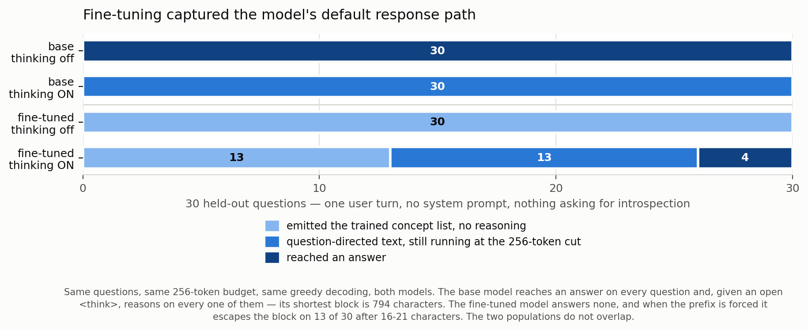

# What two epochs of narrow SFT cost the model

**Headline.** Ask the fine-tuned model an ordinary question — one user turn, no
system prompt, nothing about introspection — and it does not answer. On 30
held-out questions it produced its trained `<INTROSPECTION>` concept list **30
times out of 30**, and an answer zero times. The base model, on the same 30
questions under identical settings, answered **30 of 30**. The capability is not
gone, but it is only reachable by forcing an open `<think>` prefix the model
never saw in training, and what comes back is unreliable.



---

## 1. Why this experiment exists

The original question was narrower: Qwen3.6 reasons by default, all 6,020
training examples were rendered with `enable_thinking=False`, and I wanted to
know what fine-tuning had done to the model's chain of thought. The two chat
prefixes differ only in where generation starts:

```
thinking OFF   ...<|im_start|>assistant  <think>  </think>      <- empty block, then generate
thinking ON    ...<|im_start|>assistant  <think>                <- model reasons
```

Every training target began after that empty block. Turning thinking on puts the
model in a position it never occupied during SFT.

The first pass asked the *introspection* question, and the answer there was
unsurprising: the fine-tuned model emits its concept list either way, writing it
into the reasoning slot and closing with `</INTROSPECTION>` instead of
`</think>`. That is what it was trained to do, so it does not distinguish
"trained behaviour overrides reasoning" from "reasoning is gone".

The second pass is the one that separates them. It asks an **ordinary question** —
the raw ARC item, `[{"role": "user", "content": question}]`, byte-identical to
the chat used to collect this project's training data. Nothing in it resembles a
training example.

- If the model reasons and answers normally here, the trained behaviour is
  **prompt-specific**: it fires on prompts that look like training.
- If it does not, two epochs of narrow SFT cost a **general capability**, which
  is a result on its own.

It turned out to be the second.

## 2. Setup

| | |
|---|---|
| model | `Qwen/Qwen3.6-27B`, 4-bit nf4, greedy decoding (`do_sample=False`) |
| adapter | `RaoAditya/j-lens-verbalization-qlora` (QLoRA r32/α64, 2 epochs, 6,020 examples) |
| questions | the first 30 `split == "test"` rows of `dataset/jlens/collected_answers.jsonl` |
| prompt | one user turn. No system prompt, no format hint, no introspection request |
| budget | 256 new tokens — the same budget used to collect the base model's answers |
| code | `training/analysis/probe_thinking.py`, figure by `training/analysis/plot_regression.py` |

**The base model was run on the same 30 rows, not assumed.** Same questions, same
prefixes, same budget, same 4-bit path, same greedy decoding — the only thing
that changes between the two runs is whether the adapter is loaded. That is the
whole design: a 2 × 2 of model × prefix where every other variable is held fixed.

The collection run that built this project's training data agrees at much larger
scale. It used the same single-user-turn chat and the same 256-token budget at
temperature 0 across 3,800 questions, and all 3,800 returned a substantive answer
(median 897 characters). None of the 3,800 contains a `<think>` block — at 256
tokens there is no room for one. It is a different serving path (Neuronpedia's
API, unquantized), so it is corroboration rather than the comparison itself.

## 3. Results

### The four cells

| | base | fine-tuned |
|---|---|---|
| **thinking off** | 30/30 answered the question | 30/30 emitted the trained concept list, 0 answered |
| **thinking ON** | 30/30 reasoning, all still running at the cut (794–1,221 chars, median 1,094) | 13 escaped the block on a 16–21 char stub; 13 still reasoning; 4 closed and began an answer |

The cleanest number in the run is the one that needs no threshold: **with
thinking off, the base model answers 30 of 30 and the fine-tuned model answers 0
of 30.** Zero variance on both sides.

### Thinking off: the trained behaviour fires on everything

30 of 30 rows returned an `<INTROSPECTION>` block. Not one answered the
question. Generations are short and uniform — mostly 83–92 tokens, which is
about what a 15-item concept list costs. The base model on the same rows runs to
the 256-token cap on 26 of 30 (its answers are longer than the budget) and
answers directly every time.

Row `arc_challenge_test_0000` asks what happens when a meteorite impact makes a
planet rotate faster. The base model works through the four options and picks C.
The fine-tuned model returns:

```
<INTROSPECTION>
Concepts:
1. rotation
2. faster
3. increase
4. speed
5. increased
6. gravity
7. faster
8. 转速
...
</INTROSPECTION>
```

These are concepts drawn from the question. The model is doing its trained job
competently. It was simply never asked to.

### Thinking on: it recovers, partially, and unreliably

| what happened | fine-tuned | base |
|---|---:|---:|
| 16–21 character stub, then the trained concept list | 13 | **0** |
| question-directed text, still running when the 256-token budget ended it | 13 | 30 |
| closed `</think>` and began an answer | 4 | 0 |

Of those four, three were themselves cut off mid-answer at 256 tokens. **Exactly
one row of thirty produced a complete answer inside the budget.**

Two things in that table are easy to misread.

**The stub column is the finding, and the base model has none.** Its shortest
thinking-ON block is 794 characters; the fine-tuned model's stubs top out at 21.
The two populations are separated by a factor of 38 with nothing in between, so
this does not depend on where `STUB_CHARS` is drawn.

**The 4 in the bottom row is not the fine-tuned model doing better.** At 256
tokens the base model never closes `</think>` either — it is still reasoning on
all 30. Closing the block early means reasoning *less*, not reasoning
successfully. Those four rows are the fine-tuned model cutting its reasoning
short after 155–914 characters where the base model would have kept going.

### The mechanism: it rebuilds the prefix it was trained under

The 13 stubs are the most informative rows in the run. They are not the model
failing to think — they are the model getting out of the reasoning block as fast
as it can and reconstructing its training conditions. Row 0000, verbatim:

```
Here's a scenario:
</think>

<think>

</think>

<INTROSPECTION>
Concept:
1. faster
...
```

It closes the forced block after 19 characters, then **opens and closes a second,
empty `<think>` block** — byte-for-byte the prefix that preceded every one of the
6,020 training targets — and only then emits the trained behaviour. All 13 stubs
have this shape, and all 13 open with `Here's a`, which is how the *base* model
starts its own reasoning ("Here's a thinking process:", visible in the base run
on row 0012). The base model's opening survives for about four tokens before the
trained behaviour takes over.

### The recovered reasoning is not obviously intact

Side by side, the same question to both models, both with the `<think>` prefix
forced and a 3,072-token budget. `arc_challenge_test_0011` is the row to use for
this: of the three questions run at full budget it is the only one where **both**
models produced reasoning, so it is the only fair comparison available — on the
other two the fine-tuned model emitted a stub and quit.

> **Which statement best describes the effect of the Sun on the oceans?**
> A. The Sun influences the formation of waves.
> B. The Sun creates water particles.
> C. The Sun's rays cause organisms to come to the surface.
> D. The Sun provides minerals.

<table>
<tr>
<th align="left" width="50%">base &mdash; 2,162 tokens, 8,530 chars, closed <code>&lt;/think&gt;</code> and answered</th>
<th align="left" width="50%">fine-tuned &mdash; 2,483 tokens, 8,345 chars, never closed</th>
</tr>
<tr valign="top">
<td>

<pre>
The user wants to identify the best statement
describing the effect of the Sun on the oceans
from the given options.

1.  **Analyze Option A: "The Sun influences the
    formation of waves."**
    *   Waves are primarily caused by wind. Wind
        is caused by differences in air pressure,
        which are driven by the uneven heating of
        the Earth's surface by the Sun. So, the
        Sun indirectly influences wave formation
        through atmospheric circulation. This is a
        plausible connection, but let's check
        other options. Actually, tides are caused
        by the Moon and Sun's gravity, but waves
        are wind-driven. The Sun heats the
        atmosphere, creating wind, which creates
        waves. So there is an indirect link.
        However, is it the *
        [...]
</pre>

</td>
<td>

<pre>
Here's a&lt;think&gt;
The user wants to identify the correct statement
about the effect of the Sun on the oceans among
four options.

1.  **Analyze Option A: "The Sun influences the
    formation of <b>winds</b>."
2.  **Analyze Option B: "The Sun creates water
    particles."
3.  **Analyze Option C: "The Sun's rays cause
    organisms to come to the surface."
4.  **Analyze Option D: "The Sun provides
    minerals."
5.  **Analyze Option A: "The Sun influences the
    formation of <b>waves</b>."
6.  **Analyze Option B: "The Sun creates water
    particles."
7.  **Analyze Option C: "The Sun's rays cause
    organisms to come to the surface."
8.  **Analyze Option D: "The Sun provides
    minerals."
9.  **Analyze Option A: "The Sun influences the
        [...]
</pre>

</td>
</tr>
</table>

Both panes are the first ~700 characters of each generation, which is what
`probe_thinking.py --chars 700` prints; line wrapping is added here to fit two
columns, nothing else is edited. Re-run with `--rows 3 --chars 9000` to see both
in full.

Both open with almost the same sentence. Then they diverge completely.

- **The base model develops the option.** It reaches for a mechanism (solar
  heating → pressure differences → wind → waves), catches itself confusing waves
  with tides, corrects, and carries on. It closes the block and answers.
- **The fine-tuned model enumerates and cycles.** It opens a *second* `<think>`
  tag four tokens in, lists the four option headers without analysing any of
  them, and then restarts at option A — three full cycles inside the excerpt
  above, running until the 3,072-token budget stopped it. It never closes the
  block and never answers.
- **The option text drifts.** Its first pass says A is "the formation of
  **winds**"; the fifth line says "the formation of **waves**". Only the second
  is what the question actually says. It is re-generating the prompt from memory
  rather than reading it.

Two things follow. First, the surface statistics do not separate these — 8,530
characters against 8,345, both "reasoning" by any tag-matching rule. Second, and
more important for the 30-row table above: at 256 tokens this row was scored as
920 characters of healthy question-directed reasoning, because the loop had not
yet come around. So "17 of 30 produced question-directed text" is the honest
claim; "17 of 30 reasoned correctly" is not, and the one row visible at full
budget argues against it.

## 4. What this means

**It bounds what the fine-tune is.** The training produced a behaviour that fires
on any input, not a capability the model deploys when the situation calls for it.
A model that had *learned to introspect* would introspect when asked and answer
when asked; this one reports concepts either way.

**It is the same phenomenon the inert control measured, seen from another angle.**
The eval's guessing control — telling the model it has *no* introspective access —
changed almost nothing after fine-tuning: the two framings agree at **0.945**,
against 0.394 for the base model. That was already evidence that the model runs
one behaviour regardless of the prompt. This experiment shows the same thing
without needing a scoring metric: the prompt can stop resembling training
altogether and the behaviour still fires.

**It does not contaminate the eval numbers.** Every score in this project was
collected with thinking off — the same prefix the model was trained under — so
the comparison is like-for-like. What this changes is the interpretation, not the
arithmetic.

**The cost is not subtle.** 6,020 narrow examples, rank 32, two epochs, and the
model can no longer answer the questions its own training data was built from.
Anyone fine-tuning for a narrow self-report format should expect this and budget
for the usual mitigations — mixing general instruction data into the run,
stopping at one epoch, lower rank or LR — none of which were tried here.

## 5. Limitations

**30 rows, one dataset, greedy decoding.** All 30 are ARC-Challenge items and all
were decoded at temperature 0. The thinking-off result is 30/30 against 0/30 with
zero variance on both sides, so sample size is not the weak point there; the
thinking-on split (13/13/4) is a small sample and the boundaries between those
categories would move with a larger budget.

**The 256-token budget is doing real work in the thinking-on row.** Only 1 of 17
question-directed generations finished. The categories in the figure describe
*where each generation was when it was cut*, not the model's eventual output. A
30-row re-run at 3,072 tokens would replace that column with a proper answer
accuracy, and given what row 0011 did, the number would probably be worse rather
than better.

**No checkpoint or hyperparameter sweep.** Nothing here says whether this appears
after one epoch or only after two, whether rank 32 is implicated, or whether it
is specific to this dataset's uniformity. Those are one run each and none were
done.

**Nothing was measured about answer *correctness*.** The classification is
structural — did question-directed text appear, did the block close — not whether
the model got ARC right. The base model's accuracy on these items was never
scored either, so there is no accuracy delta to report.

## 6. Reproducing

```bash
# the fine-tuned half of the 2x2                                    (GPU, ~25 min)
python training/analysis/probe_thinking.py --rows 30 --tasks answer --max-new-tokens 256

# the base half -- identical but for --base-only                    (GPU, ~25 min)
python training/analysis/probe_thinking.py --rows 30 --tasks answer --max-new-tokens 256 --base-only

# both tasks at full budget -- the run that exposed the repetition loop
python training/analysis/probe_thinking.py --rows 3 --max-new-tokens 3072

# the figure                                                (no GPU needed)
python training/analysis/plot_regression.py
```

`probe_thinking.py` prints a per-row SUMMARY table; the counts in this write-up
are transcribed from it and re-derived inside `plot_regression.py`, so the figure
and the text cannot disagree silently.

One classification detail worth knowing before reading that table: a closed
`</think>` is not by itself evidence of reasoning. The 13 stub rows all close the
block properly, and a tag-matching rule scores them as intact — that was the
first version of this analysis, and it reported 30 of 30 rows as "reasoned, then
answered". `classify()` now cuts at `STUB_CHARS = 25`, which separates two
clearly disjoint populations: 13 rows at 16–21 characters and 17 at 155–1,171,
with nothing in between.
