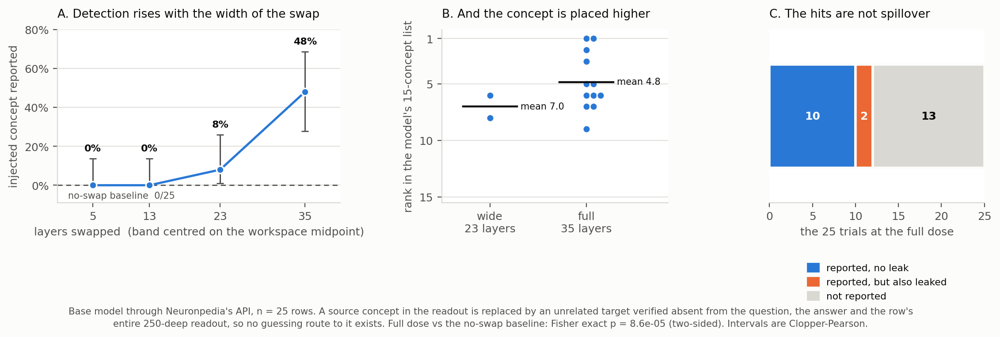

# Concept swap: put a foreign concept in the workspace and ask what is there

**Headline.** Replace one concept in the model's Jacobian-Lens readout with an
unrelated word — verified absent from the question, from the answer, and from the
row's entire 250-deep readout — then ask the model, in ordinary language, which
concepts were active. It names the injected word **12 times out of 25** at the
full dose, against **0 out of 25** with no swap. Detection rises monotonically
with the width of the swapped layer band, and the model places the concept higher
in its list as the dose increases.



Fisher exact, full dose vs the no-swap baseline: **p = 8.6e-05** (two-sided;
4.3e-05 one-sided).

---

## 1. Why this experiment is the important one

Every other measurement in this project can, in principle, be explained by a
model that has learned to *predict* J-lens output from the text in front of it.
The text-only baseline makes that concrete: a bag-of-words nearest-neighbour
predictor that never sees an activation reaches 0.427 of the fine-tuned model's
0.579 on list B.

Swap removes that route entirely. The prompt is unchanged. The question is
unchanged. The answer is unchanged. The only thing that differs between the two
arms is a vector inside the model. If the report follows, it followed something
that is not in the text.

The target words are chosen to make guessing impossible rather than merely
unlikely: each is checked against the question, the answer, **and the row's full
250-deep lens readout**, so the concept is not a thing the model was already
close to saying.

## 2. Setup

| | |
|---|---|
| model | `qwen3.6-27b`, base, through Neuronpedia's API |
| rows | 25, drawn across ARC, GSM8K, BBH, TruthfulQA and HotpotQA |
| calls | 25 × 6 = 150 (four doses, a no-swap baseline, a leakage probe) |
| intervention | `steerTokens` = the source concept, `swapToken` = the target, `steerLayers` = the band, `steerGeneratedTokens: true` |
| ask | the ordinary introspection prompt with the `<INTROSPECTION>` format spec — 15 concepts |
| code | `dataset/jlens/analysis/injection_curve.py`, figure by `training/injection/plot_swap.py` |

**The dose is the width of the band, not a strength.** `swapToken` has no
strength parameter — its magnitude is whatever `h · ŝ` happens to be — so the
only way to graduate the intervention is to apply it across more layers. Four
bands, all centred on the workspace midpoint:

| dose | layers | width |
|---|---|---:|
| narrow | 39–43 | 5 |
| small | 35–47 | 13 |
| wide | 30–52 | 23 |
| full | 24–58 | 35 |

The full band is the workspace band this project uses throughout.

## 3. Results

| dose | layers | detected | rate | 95% CI | mean rank |
|---|---:|---:|---|---|---:|
| narrow | 5 | 0/25 | 0% | [0.0%, 13.7%] | — |
| small | 13 | 0/25 | 0% | [0.0%, 13.7%] | — |
| wide | 23 | 2/25 | 8% | [1.0%, 26.0%] | 7.00 |
| full | 35 | 12/25 | **48%** | [27.8%, 68.7%] | **4.83** |
| no-swap baseline | — | 0/25 | 0% | [0.0%, 13.7%] | — |

Intervals are Clopper-Pearson. (An earlier version of this table in the decision
log recorded the 0/25 rows as `[0%, 0%]`, which is not a valid interval — 0 of 25
is consistent with a true rate as high as 13.7%. That matters for reading the two
zero doses: they are *consistent with zero*, not *demonstrated to be zero*.)

Some of the detections, with the source concept that was replaced:

| row | swapped | → injected | reported at rank |
|---|---|---|---:|
| `arc_challenge_test_0017` | ` temperature` | **french** | 1 |
| `gsm8k_test_0028` | ` distance` | **variables** | 1 |
| `bbh_tracking_shuffled_objects_five_objects_0004` | ` exchanged` | **prices** | 2 |
| `bbh_causal_judgement_0009` | ` logic` | **financial** | 5 |
| `arc_challenge_test_0000` | ` speed` | **equation** | 6 |

`french` is not in a question about temperature. It is not in the answer. It is
not in the 250 concepts the lens reads out of that row. The model put it first.

### Three properties that make this hard to explain away

**1. The dose-response is monotonic and the baseline is pinned at zero.** 0% →
0% → 8% → 48%, with 0/25 on the no-swap arm throughout. A model that produced
plausible-sounding concepts at random would not track the width of a layer band
it cannot see.

**2. Rank tracks dose.** Among detections, mean rank is 7.0 at 23 layers and 4.83
at 35. The model does not merely notice the concept; it ranks it higher when it
is injected more strongly. That is magnitude sensitivity, and it is a stronger
claim than binary detection.

**3. Leakage was measured, not argued.** The obvious alternative explanation is
that the swap pushes the token into the output distribution generally, so the
model says it whatever you ask. The leakage probe asks the model to restate its
answer instead of introspecting: the injected token appeared in only **2 of 25**.
Excluding those two entirely still leaves **10 clean hits against 0 baseline**.

### The curve is threshold-like, not linear

Nothing happens below about 23 layers, then it jumps. That fits the source
paper's account of the workspace as a broad, distributed broadcast format — a
narrow injection does not reach enough of it to register.

## 4. How this relates to the steering experiment

These are two different interventions, and the write-ups should not be read as a
single curve.

| | this experiment | [activation-injection](../activation-injection/) |
|---|---|---|
| intervention | `swapToken`, Neuronpedia API | `steer`, local, `h += clamp(strength·‖h‖)·t̂` |
| models | base only | base **and** fine-tuned |
| dose axis | width of the layer band | strength, at a fixed band |
| measurement | does the word appear in a 15-item list | rank of the word over all 248,320 tokens |
| result | 0% → 48%, p = 8.6e-05 | median rank 25,942 → 93 (base), 19,896 → 672 (fine-tuned) |

**Why the base-vs-fine-tuned comparison could not use swap.** `swapToken` is an
API parameter, and Neuronpedia hosts the base model, not the adapter. Anything
comparing the two models had to run locally, and locally `swap` gives no dose
axis at all.

**An unexplained discrepancy, stated rather than smoothed over.** Our local
`swap` implementation, applied to the *same* 24–58 band, perturbs the residual by
**0.2% of ‖h‖** and produced 0% detection — while putting the injected concept at
lens rank 1. Neuronpedia's `swapToken` over the same nominal band produced 48%.
Same name, same layers, very different behavioural effect, so the two are not
doing the same thing. I did not chase this down. It does not undermine either
result — each is internally consistent — but it does mean "swap" names two
operations in this repository, and the 48% here is **not** comparable to the 0%
recorded as dead end #1 in the steering write-up.

## 5. Limitations

**Base model only.** There is no fine-tuned arm, for the API reason above. So
this says something about Qwen3.6-27B and nothing about what the fine-tuning did.

**n = 25.** The full-dose interval is [27.8%, 68.7%] — wide. The result that the
sample size does *not* threaten is the contrast with baseline, which is 12/25
against 0/25.

**The detection metric is a grep of a 15-item list.** It asks whether the model
spontaneously selected the injected word into a list of fifteen. That is a harsh
metric — a concept the model registered but ranked 20th scores as a miss — so
48% is a floor, not an estimate of how often the concept was present. The
rank-based protocol in the steering experiment exists precisely because this
metric throws that information away.

**The leakage probe is a control, not a proof.** It shows the injected token does
not simply flood the output. It does not rule out subtler forms of the same
thing, such as the swap raising the token's probability specifically in
list-shaped contexts.

**The n = 20 pilot's raw data is gone.** It is summarised as 50% detection with
10% leakage and it reproduced the manually-observed India→USA swap, but only the
summary survives, so those numbers are not re-derivable here.

**This is a replication, not a discovery.** The Anthropic workspace paper reports
59% success on its own swap experiments. What is new here is the dose-response
and the leakage accounting, not the phenomenon.

## 6. Reproducing

```bash
# the experiment -- needs a Neuronpedia API key, no GPU   (150 API calls)
python dataset/jlens/analysis/injection_curve.py

# the figure and every statistic in this write-up         (no GPU, no key)
python training/injection/plot_swap.py
```

`plot_swap.py` re-derives every rate, interval and p-value in this document from
`injection_curve_results.json`, so nothing above is transcribed by hand. That
JSON is gitignored along with the project's other result files; the write-up and
the code that reads it are what live in the repo.
